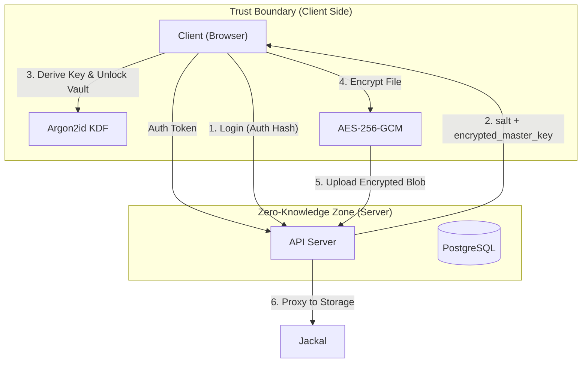
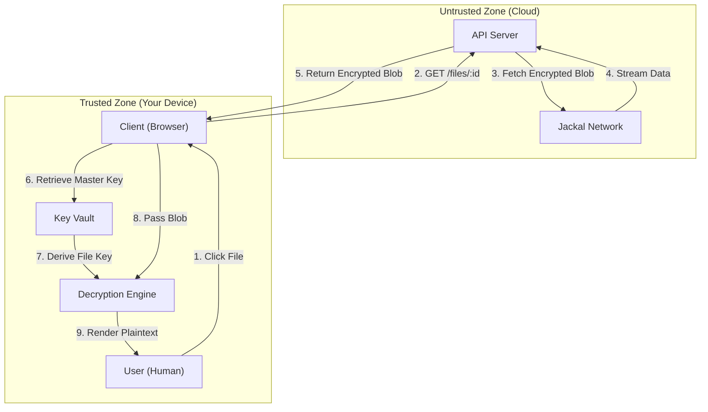

# Nest

> **Zero-Knowledge Encrypted Cloud Storage System**
> *Secure by design. Private by default.*


Nest is an enterprise-grade, zero-knowledge cloud storage platform engineered for absolute data privacy. It leverages client-side encryption and decentralized storage networks to ensure that **only the user** holds the keys to their data. The server acts purely as a blind facilitator, having zero visibility into file contents, filenames, or folder structures.

---

## 🏗 System Architecture

Nest employs a **Hybrid Zero-Knowledge Architecture**. All sensitive operations (encryption, decryption, key management) occur strictly in the browser. The server handles authentication, metadata synchronization, and encrypted blob storage facilitation.



### Data Retrieval & Decryption Flow



---

## 🚀 Key Features

### 🔐 Zero-Knowledge Security
*   **Client-Side Encryption:** Files are encrypted with `AES-256-GCM` before they ever leave the user's device.
*   **Encrypted Metadata:** Filenames, folder structures, and file types are encrypted. The database only sees opaque blobs and random UUIDs.
*   **Master Key Architecture:** A derived Master Key unlocks Folder Keys, which in turn unlock File Keys. This hierarchical key management allows for secure and distinct sharing scopes.

### 💾 Decentralized Storage
*   **Jackal Protocol Integration:** Files are stored on the Jackal decentralized storage network, ensuring high availability and censorship resistance.
*   **Chunking & Resiliency:** Large files are split into encrypted chunks, allowing for resumable uploads and handling files up to **10GB**.
*   **Redundancy:** Files are verified on the Jackal gateway to insure durability.

### ⚡ Enterprise Capabilities
*   **Secure Sharing:** Create time-bound, encrypted share links. External users decrypt files locally using a hash fragment key (never sent to the server).
*   **Quota Management:** Granular storage quotas per user tier (Free/Pro/God Mode).
*   **Trash & Recovery:** Soft-delete functionality with a configurable retention policy (default 24h auto-purge).
*   **Idempotent Uploads:** Robust upload queue handling to prevent duplicates and race conditions.

---

## 🛠 Technology Stack

### Frontend (Client)
*   **Framework:** [React 19](https://react.dev/)
*   **Build Tool:** [Vite](https://vitejs.dev/)
*   **Language:** TypeScript
*   **Styling:** TailwindCSS + Phosphor Icons
*   **Encryption:** `libsodium-wrappers` (WASM), `hash-wasm`
*   **State Management:** React Context + Optimistic UI updates

### Backend (Server)
*   **Runtime:** Node.js (Express)
*   **Database:** PostgreSQL (via [Drizzle ORM](https://orm.drizzle.team/))
*   **Authentication:** JWT + Argon2id (for password hashing)
*   **Storage:** Jackal.js SDK
*   **Security:** Helmet, CORS, Rate Limiting (Express-Rate-Limit)
*   **Logging:** Winston (Structured logging)

---

## 🚦 Getting Started

### Prerequisites
*   Node.js v20+
*   PostgreSQL
*   Doppler (for environment secret management)

### Installation

1.  **Clone the repository**
    ```bash
    git clone https://github.com/jtoba66/Lazybird-Nest.git
    cd Lazybird-Nest
    ```

2.  **Install dependencies (Root & Server)**
    ```bash
    npm install
    cd server && npm install
    ```

3.  **Environment Setup**
    Ensure you have access to the configured Doppler project, or create `.env` files matching the schema in `server/src/config/env.ts`.

4.  **Database Migration**
    ```bash
    cd server
    npm run db:push
    ```

5.  **Run Locally**
    You can run both client and server concurrently using the root dev script:
    ```bash
    # From root directory
    npm run dev
    ```
    *   Frontend: `http://localhost:5173`
    *   Backend: `http://localhost:3004`

---

## 🛡 Security Deep Dive

### The "No-Knowledge" Guarantee
Nest is built on the principle that the server is **untrusted**.

1.  **Login Process:**
    *   User enters email/password.
    *   Client derives `AuthHash` (for login) and `MasterKey` (for data) independently.
    *   Only `AuthHash` is sent to the server (over TLS). `MasterKey` **never** leaves the memory of the client device.

2.  **Data Hierarchy:**
    *   `MasterKey` decrypts -> `RootFolderKey`
    *   `RootFolderKey` decrypts -> `SubFolderKeys`
    *   `SubFolderKey` decrypts -> `FileKeys`
    *   `FileKey` decrypts -> `File Payload`

 This isolation ensures that even if the database is completely compromised, attacker obtains only useless, high-entropy random data.

### 🔐 Cryptography Suite
Nest utilizes a hybrid encryption scheme to balance security and performance:

| Component | Algorithm | Purpose |
| :--- | :--- | :--- |
| **Key Management** | **XChaCha20-Poly1305** | Used for wrapping Master Keys, Folder Keys, and Filenames. Chosen for its nonce-misuse resistance and 192-bit nonces. |
| **File Encryption** | **AES-256-GCM** | Used for high-throughput stream encryption of file blobs. Provides authenticated encryption with hardware acceleration. |
| **Identity** | **Argon2id** | Memory-hard password hashing function used to derive the authentication hash and master key from the user's password. |

---

## 📦 Deployment

### Build
```bash
# Frontend
npm run build

# Backend
cd server && npm run build
```

### Production Considerations
*   **HTTPS is Mandatory:** The Web Crypto API and Service Workers require a secure context.
*   **WASM Support:** Ensure your web server serves `.wasm` files with the correct MIME type (`application/wasm`).
*   **Memory Limits:** For handling large file encryption, Node.js heap size may need adjustment (`--max-old-space-size=4096`).

---

## 📄 License & Legal

**Copyright © 2026 LazyBird Inc. All Rights Reserved.**

This software is the confidential and proprietary information of LazyBird Inc. ("Confidential Information"). You shall not disclose such Confidential Information and shall use it only in accordance with the terms of the license agreement you entered into with LazyBird Inc.
